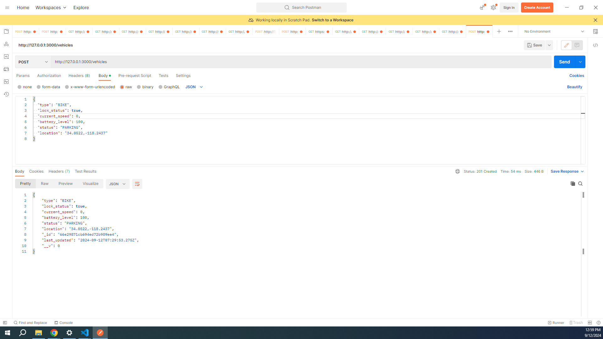

# BayaFleet Technical Assessment - Software Development

This is the nodejs code for Vehicle Management Page.

### Database Schema
To store the vehicle data shown in the UI, the database schema could include the following table:

#### Table: Vehicles
- **vehicle_id** (Primary Key, Integer): Unique identifier for each vehicle.
- **type** (String): Type of vehicle, e.g., "Scooter".
- **lock_status** (Boolean): Indicates whether the vehicle is locked (`true`) or unlocked (`false`).
- **current_speed** (Float): The current speed of the vehicle in km/h.
- **battery_level** (Integer): Percentage representing the battery level.
- **status** (String): Operational status of the vehicle, e.g., "PARKING", "MOVING", "IDLING", "TOWING".
- **location** (String or Geolocation Data Type): Location of the vehicle, potentially stored as coordinates or a descriptive string.
- **last_updated** (DateTime): The timestamp when the vehicle's data was last updated.

### API Structure
For the Vehicle Management system, the API could be structured to handle CRUD operations for vehicles as well as specific actions like locking and unlocking. Here’s a possible RESTful API structure:

#### Endpoints

- **GET /vehicles**
  - **Description**: Retrieves a list of all vehicles.
  - **Query Parameters**: Allows filtering by type, status, lock status, etc.

- **POST /vehicles**
  - **Description**: Adds a new vehicle to the system.
  - **Body**: JSON object containing new vehicle data (excluding `vehicle_id`, which is auto-generated).

- **GET /vehicles/{vehicle_id}**
  - **Description**: Retrieves detailed information about a specific vehicle.

- **PUT /vehicles/{vehicle_id}**
  - **Description**: Updates data for a specific vehicle.
  - **Body**: JSON object containing fields to update (type, lock_status, current_speed, battery_level, status, location).

- **DELETE /vehicles/{vehicle_id}**
  - **Description**: Removes a vehicle from the system.

- **POST /vehicles/{vehicle_id}/lock**
  - **Description**: Locks a specific vehicle.
  - **Body**: Optionally, could specify conditions or time for automatic unlocking.

- **POST /vehicles/{vehicle_id}/unlock**
  - **Description**: Unlocks a specific vehicle.

### Additional Considerations
- **Security**: API should include authentication and authorization mechanisms to protect sensitive data and operations.
- **Performance**: For systems with many vehicles or high-frequency updates, consider performance optimization techniques, such as caching frequently accessed data.
- **Real-Time Updates**: For elements like current speed or location that may change frequently, consider using WebSockets or another real-time technology to push updates to the UI.

